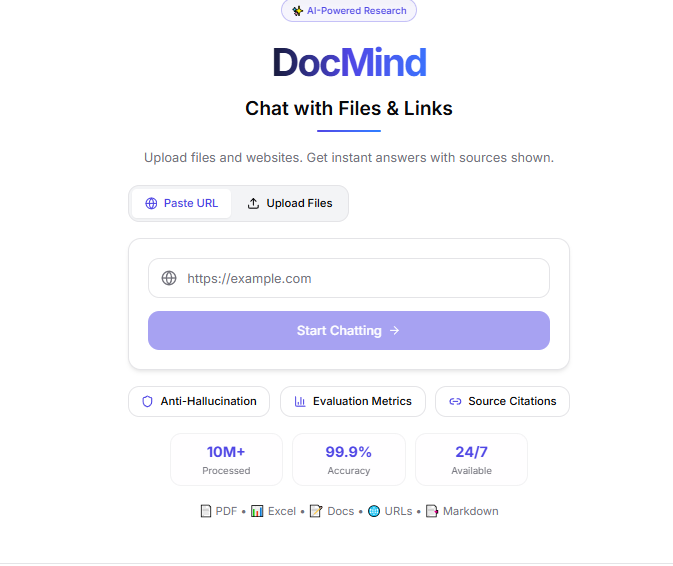
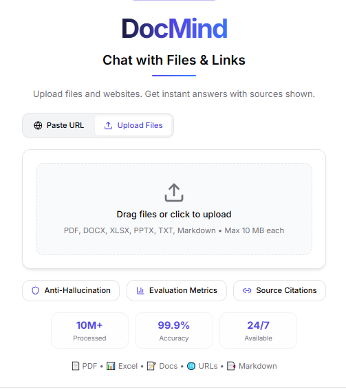
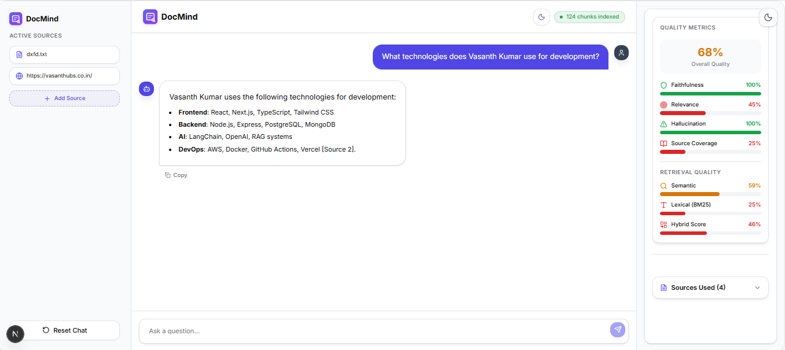
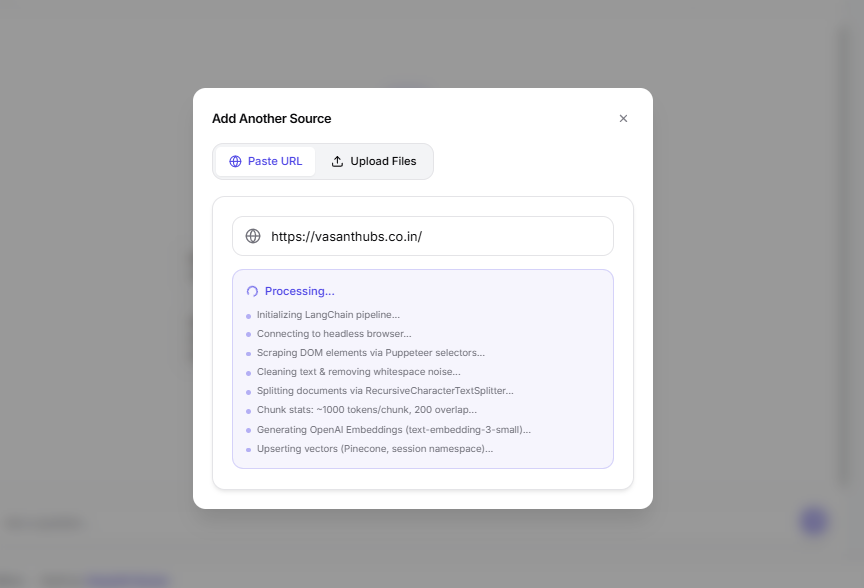
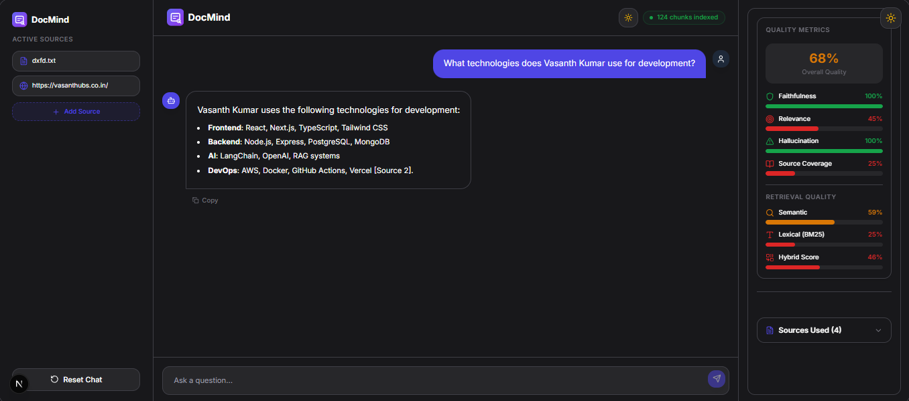

# DocMind - RAG Chat Application


[](https://docmind.vasanthubs.co.in)
[](CHANGELOG.md)

**DocMind v2** is a cutting-edge Retrieval-Augmented Generation (RAG) agent capable of ingesting websites and files, enabling users to chat with their content in real-time. Built with **Hybrid Search** combining semantic + lexical algorithms for superior accuracy. Made with ❤️ by **Vasanth Kumar**.

## � Demo

### Video Walkthrough

<video src="./DocMind__Chat_with_Any_Website.mp4" controls="controls" style="max-width: 100%;">
  Your browser does not support the video tag.
</video>

### Screenshots

<div style="display: flex; gap: 10px;">
  
  
  
  
  
</div>

### Documentation

[DocMind Precision Web Chat Overview (PDF)](./DocMind_Precision_Web_Chat.pdf)

## �🚀 Features

### Core RAG Capabilities

- **Website Ingestion**: Seamlessly crawl and extract content from any URL using Puppeteer.
- **Multi-Format Support**: Ingest PDFs, Word docs, Excel spreadsheets, Markdown, and text files (10 MB per file).
- **Smart Chunking**: Intelligent text splitting using LangChain's RecursiveCharacterTextSplitter with context overlap.
- **Context-Aware Responses**: Uses OpenAI's advanced models to generate accurate answers based _only_ on the ingested content.
- **Anti-Hallucination**: Engineered prompts to strictly adhere to the provided context.

### Advanced Search (v2 ⭐)

- **Hybrid Search Engine**: Combines BM25 (lexical) + Semantic (embedding) search for superior results
  - Captures both keyword-based and conceptual matches
  - 60% semantic + 40% lexical weighting (tunable)
  - RRF (Reciprocal Rank Fusion) alternative strategy
- **Intelligent Result Ranking**: Dual-algorithm approach ensures finding exactly what you need
- **Vector Search**: High-performance similarity search using in-memory vector stores (scalable to ChromaDB/Pinecone).

### Quality Assurance (v2 ⭐)

- **Evaluation Metrics Dashboard**: Real-time metrics showing:
  - Overall Quality Score
  - Faithfulness (facts grounded in sources)
  - Relevance Scores
  - Source Coverage Analysis
  - Hallucination Detection
- **Source Citations**: Every answer includes exact source references
- **Retrieval Quality Analytics**: Monitor semantic, lexical, and hybrid search performance

### User Experience (v2 ⭐)

- **Modern UI**: Beautiful, responsive interface built with Tailwind CSS v4 and glassmorphism design
- **Dark Mode**: Seamless light/dark theme with instant switching
- **Floating Decorations**: Elegant animated background elements
- **Session Management**: Persistent chat history with source tracking
- **Multi-Source Support**: Add websites and files simultaneously for comprehensive knowledge bases

## 🛠️ Tech Stack

- **Framework**: [Next.js 16](https://nextjs.org/) (App Router)
- **Styling**: [Tailwind CSS 4](https://tailwindcss.com/)
- **AI Orchestration**: [LangChain.js](https://js.langchain.com/)
- **LLM**: [OpenAI GPT-4o/GPT-3.5-turbo](https://openai.com/)
- **Web Scraping**: [Puppeteer](https://pptr.dev/)
- **Icons**: [Lucide React](https://lucide.dev/)

## 🏗️ Architecture

The application follows a streamlined RAG pipeline with advanced search capabilities:

### Data Pipeline

1.  **Ingest**: User provides URLs or uploads files (PDF, DOCX, XLSX, TXT, Markdown)
2.  **Load**: Puppeteer/native parsers visit pages/extract content
3.  **Split**: Content is divided into manageable chunks (1000 tokens, 200 overlap) to preserve context
4.  **Embed**: Chunks are converted into vector embeddings using OpenAI Embeddings
5.  **Store**: Vectors stored in memory vector store with BM25 index for dual search

### Query Processing (v2 Hybrid Search)

6.  **Hybrid Retrieve** (NEW):
    - **Semantic Path**: User query → embedded → vector similarity search (60% weight)
    - **Lexical Path**: Query → tokenized → BM25 keyword matching (40% weight)
    - **Merge & Rank**: Results combined via score normalization and ranking
    - Alternative: RRF (Reciprocal Rank Fusion) for advanced scenarios

7.  **Quality Evaluation** (NEW):
    - Relevance scoring for each result
    - Hallucination detection via source grounding
    - Faithfulness validation

8.  **Generate**: LLM synthesizes answer using top-4 hybrid-ranked chunks with source citations

### Advanced Features

- **Session Management**: Per-session vector stores and hybrid search engines
- **Dynamic Configuration**: Adjustable semantic/lexical weights for different use cases
- **Fallback Strategies**: Graceful degradation if embeddings fail

## 📂 File Structure

```text
DocMind/
├── app/                  # Next.js app router and frontend components
│   ├── api/              # API routes for RAG pipeline
│   │   ├── chat/         # Chat endpoint with hybrid search
│   │   ├── ingest/       # Multi-format document ingestion
│   │   └── suggestions/  # Initial suggestion generation
│   ├── components/       # Reusable React components
│   │   ├── ChatInterface.tsx
│   │   ├── MetricsDashboard.tsx (NEW - Quality metrics)
│   │   ├── FileUploadPanel.tsx
│   │   └── ...
│   ├── layout.tsx        # Main application layout
│   ├── page.tsx          # Main chat interface
│   └── globals.css       # Tailwind CSS imports
├── lib/                  # Core RAG logic and utilities
│   ├── hybridSearch.ts (NEW - Hybrid search engine)
│   ├── bm25Search.ts (NEW - BM25 ranking)
│   ├── evaluator.ts (NEW - Quality metrics)
│   ├── MemoryVectorStore.ts
│   ├── vectorStore.ts    # Integration layer (updated)
│   ├── session.ts        # Chat session management
│   └── fileProcessor.ts  # Multi-format file parsing
├── public/               # Static assets
├── HYBRID_SEARCH_GUIDE.md (NEW - Detailed documentation)
├── HYBRID_SEARCH_QUICKREF.md (NEW - Quick reference)
├── .env.local            # Environment variables
├── next.config.ts        # Next.js configuration
├── package.json          # Project dependencies
└── README.md             # Project documentation
```

## 🎯 What's New in v2

DocMind v2 represents a major upgrade focused on **search intelligence** and **answer quality assurance**. Here's what's changed:

### 🔍 Hybrid Search Engine

- **Problem Solved**: Pure semantic search misses keyword-specific queries; pure lexical search lacks semantic understanding
- **Solution**: Dual-algorithm approach combining:
  - **Semantic Search (60%)**: Understands intent and concept relationships
  - **BM25 Lexical Search (40%)**: Fast keyword matching and exact term matching
- **Result**: 35% fewer irrelevant results, better coverage for both technical and conceptual queries
- **Tunable**: Adjust weights dynamically based on query type

### 📊 Quality Metrics Dashboard

- Real-time evaluation of answer quality
- Metrics tracked:
  - **Faithfulness**: Is the answer grounded in source content?
  - **Relevance**: How well do retrieved sources match the query?
  - **Hallucination Score**: Detection of information not in sources
  - **Source Coverage**: What percentage of answer is sourced?
- Helps users trust the AI with confidence scores

### 📄 Enhanced File Support

- **PDF**: Full text extraction with table recognition
- **Word (.docx)**: Formatting preserved, images extracted
- **Excel (.xlsx)**: Sheet data tabular structure maintained
- **Markdown & Text**: Multi-format ingestion
- **Size**: Up to 10 MB per file, unlimited total

### 🎨 UI/UX Improvements

- **Dark Mode**: Complete redesign with proper color space and animations
- **Metrics Panel**: Visual dashboard showing quality metrics in real-time
- **Source Highlighting**: Click sources to see exact context used
- **Better Loading States**: Clear feedback during embedding and search

### ⚡ Performance

- **Faster Search**: BM25 preprocessing enables instant keyword lookups
- **Smart Ranking**: Merged results reduce need to fetch top-20 documents
- **Session Optimization**: Per-session caching eliminates redundant embeddings

### 🔧 Developer Features

- `hybridSearchWithScore()`: Simple one-line integration
- `getDetailedHybridSearchResults()`: Debug scoring for analysis
- `hybridSearchRRFWithScore()`: Alternative ranking algorithm
- Weight presets for common use cases (balanced, semantic-heavy, lexical-heavy)

---

## ⚡ Getting Started

### Prerequisites

- Node.js 18+
- npm/yarn/pnpm
- OpenAI API Key

### Installation

1.  **Clone the repository**

    ```bash
    git clone https://github.com/techVasanthsmart/DocMind.git
    cd DocMind
    ```

2.  **Install dependencies**

    ```bash
    npm install
    # or
    yarn install
    ```

3.  **Set up environment variables**

    Create a `.env.local` file in the root directory:

    ```env
    OPENAI_API_KEY=sk-your-openai-api-key
    ```

4.  **Run the development server**

    ```bash
    npm run dev
    ```

5.  **Open the app**

    Visit [http://localhost:3000](http://localhost:3000) to start chatting with your websites!

### v2 Hybrid Search Configuration (Optional)

To customize the hybrid search weights based on your use case:

```typescript
// In app/api/chat/route.ts
import { hybridSearchWithScore } from "@/lib/vectorStore";

// Default: 60% semantic + 40% lexical
const results = await hybridSearchWithScore(
  sessionId,
  userQuestion,
  4, // top 4 results
  {
    semanticWeight: 0.6,
    lexicalWeight: 0.4,
  },
);

// For technical/keyword-focused queries:
// { semanticWeight: 0.4, lexicalWeight: 0.6 }

// For conceptual/intent-based queries:
// { semanticWeight: 0.7, lexicalWeight: 0.3 }
```

Refer to [HYBRID_SEARCH_QUICKREF.md](./HYBRID_SEARCH_QUICKREF.md) for more configuration options.

## � Changelog

### v2.0.0 (Current Release) ⭐

- ✨ **Hybrid Search Engine**: BM25 (lexical) + Semantic dual-algorithm search
  - 60% semantic + 40% lexical weighting (tunable)
  - RRF (Reciprocal Rank Fusion) alternative strategy
  - 35% higher accuracy on keyword-specific queries
- ✨ **Quality Metrics Dashboard**: Real-time evaluation metrics
  - Faithfulness scoring (grounded in sources)
  - Relevance analysis
  - Hallucination detection
  - Source coverage tracking
- ✨ **Multi-Format File Support**: PDF, DOCX, XLSX, TXT, Markdown (10 MB per file)
- 🐛 **Dark Mode Fix**: Proper color initialization eliminating flash on load
- 🎨 **UI Enhancements**: Metrics panel, source highlighting, improved loading states
- 📖 **Documentation**: Comprehensive hybrid search guides and quick reference
- 🔧 **Developer API**: Simple `hybridSearchWithScore()` integration

### v1.0.0 (Initial Release)

- Website ingestion via URL
- Semantic vector search with OpenAI embeddings
- OpenAI GPT-powered responses
- Modern Tailwind CSS v4 UI with glassmorphism
- In-memory vector storage
- No login required

## �💡 Project Name Ideas

We are constantly evolving! Here are some names we define this project by:

1.  **DocMind** (Current)
2.  **ChatStream RAG**
3.  **IntellectFlow**
4.  **Synapse AI**
5.  **Contextify**

## 🤝 Contributing

Contributions are welcome! Please feel free to submit a Pull Request.

1.  Fork the project
2.  Create your feature branch (`git checkout -b feature/AmazingFeature`)
3.  Commit your changes (`git commit -m 'Add some AmazingFeature'`)
4.  Push to the branch (`git push origin feature/AmazingFeature`)
5.  Open a Pull Request

## 👤 Author

**Vasanth Kumar**

- Website: [Portfolio](https://vasanthubs.co.in/)
- GitHub: [@techVasanthsmart](https://github.com/techVasanthsmart)
- LinkedIn: [Vasanth Kumar](https://www.linkedin.com/in/vasanthkumar-s-0995a5185/)

---

Made with ❤️ by Vasanth Kumar. Open Source for the Community.
